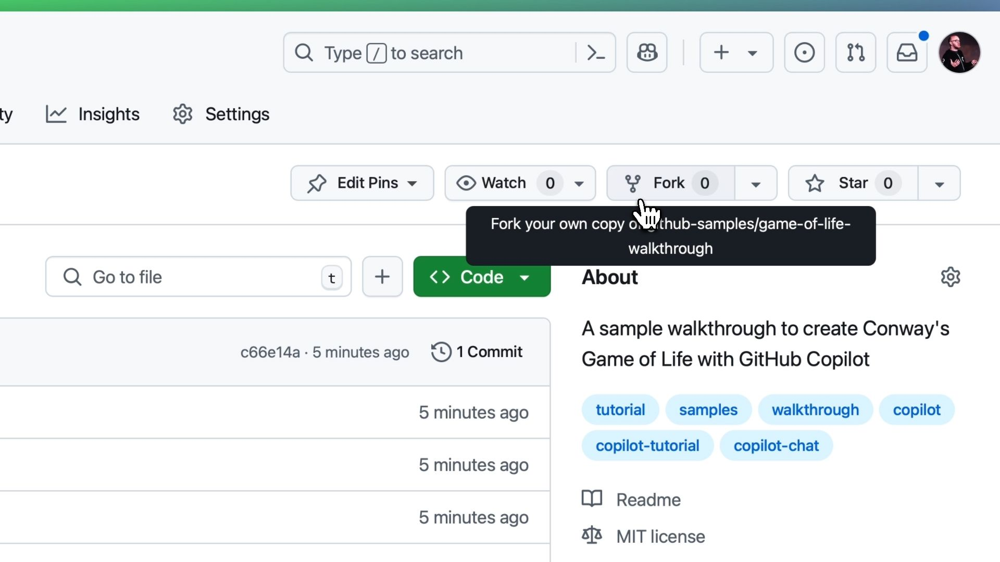
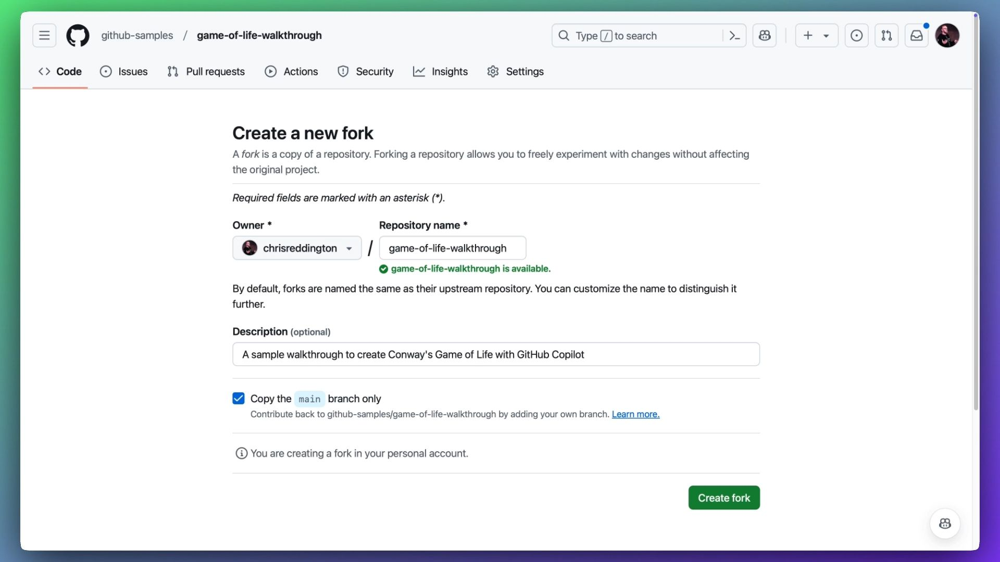
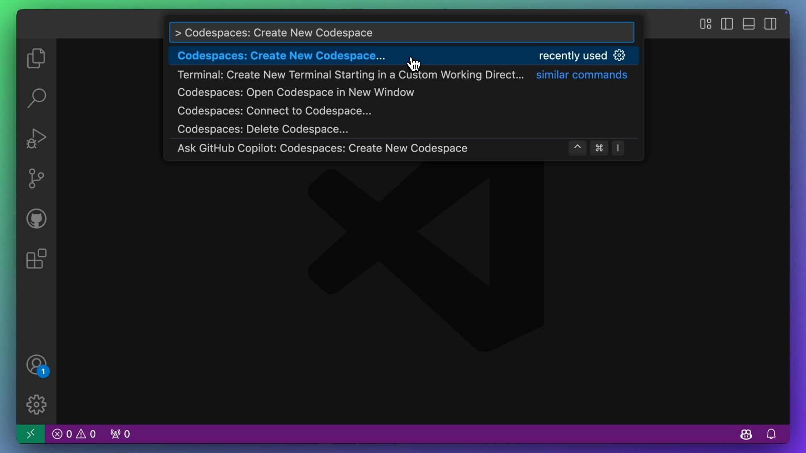
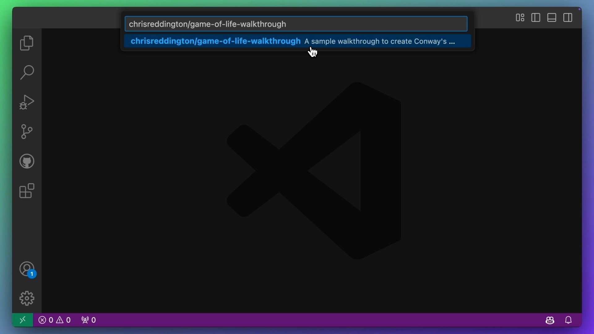
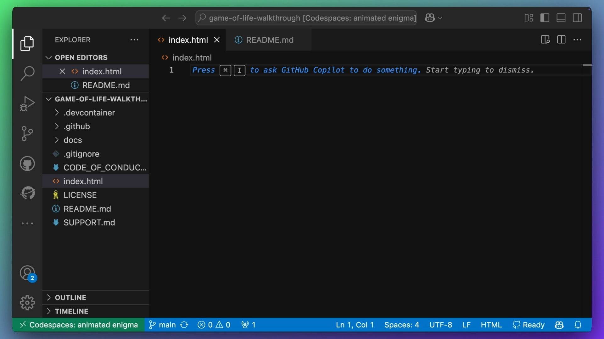

# Build Conway's Game of Life with GitHub Copilot

This repository contains a companion walkthrough to the video on
[Using GitHub Copilot to create Conway's Game of Life][youtube-video].
You can follow the steps in this repository to achieve a similar result to the video.

In this tutorial, we'll build Conway's Game of Life from scratch using GitHub Copilot
as our pair programming assistant. This simulation demonstrates how complex patterns
can emerge from simple rules, making it an interesting project for learning both
programming concepts and GitHub Copilot's capabilities.

## Getting Started

Before you get started, make sure you have the following:

- [A GitHub account][github-signup]
- [A GitHub Copilot subscription (or trial)][github-copilot]
- [Visual Studio Code][visual-studio-code] with the [GitHub Codespaces
  extension][visual-studio-code-codespaces] installed

### Create a New Repository

To get started, you need to [create a fork of this repository][repo-fork].
Follow these steps:

1. Click the `Fork` button on this repository page.

    

> [!NOTE]
> This tutorial contains steps to publish your code to GitHub Pages. If you want
> to follow along with this part, then you should either make your repository public
> or make sure you have access to a plan that allows private repositories to be
> published to GitHub Pages.

1. Fill in the repository name and description, and click the `Create fork` button.

    

### Set Up your Development Environment

Now that you have your repository set up, you need to set up your development
environment. We'll use [Visual Studio Code][visual-studio-code] and
[GitHub Codespaces][visual-studio-code-codespaces] for this tutorial.

1. Open Visual Studio Code and install the
   [GitHub Codespaces extension][visual-studio-code-codespaces] if you haven't already.

2. Sign in to your GitHub account in Visual Studio Code.

3. Open the Command Palette:
    - On Windows / Linux: <kbd>Ctrl</kbd> + <kbd>Shift</kbd> + <kbd>P</kbd>
    - On macOS: <kbd>Cmd</kbd> + <kbd>Shift</kbd> + <kbd>P</kbd>

4. Type `> Codespaces: Create New Codespace`, and select that option. 

    

5. Type in the name of your repository (e.g. `mona/game-of-life-walkthrough`) and
   select it from the list. After that, you will be asked to select an instance
   type for your Codespace.

    

6. This will create a new Codespace for you. It may take a few moments to set up,
   but once it's ready, you'll be able to see the code in your editor.

    

### Next Steps

Now that you have your development environment set up, proceed to
[Getting Started with GitHub Copilot Chat](docs/1-copilot-chat.md) to begin
exploring GitHub Copilot's capabilities.

## Table of Contents

1. [Copilot Chat](docs/1-copilot-chat.md)
2. [Copilot Edits](docs/2-copilot-edits.md)
3. [Copilot Instructions](docs/3-copilot-instructions.md)
4. [Using Inline Chat and Slash Commands](docs/4-slash-commands.md)
5. [README and Copilot Extensions](docs/5-readme-and-extensions.md)
6. [GitHub Actions and GitHub Pages](docs/6-actions-and-pages.md)

## License

This project is licensed under the MIT License - see 
the [LICENSE](LICENSE) file for details.

## Contributing

Found a mistake or want to suggest an improvement? Contributions are welcome!
Submit a Pull Request.

[github-copilot]: https://github.com/features/copilot
[github-signup]: https://github.com/join
[repo-fork]: https://github.com/github-samples/game-of-life-walkthrough/fork
[visual-studio-code]: https://code.visualstudio.com
[visual-studio-code-codespaces]: https://marketplace.visualstudio.com/items?itemName=GitHub.codespaces
[youtube-video]: https://youtu.be/pGV_T6g1hcU
