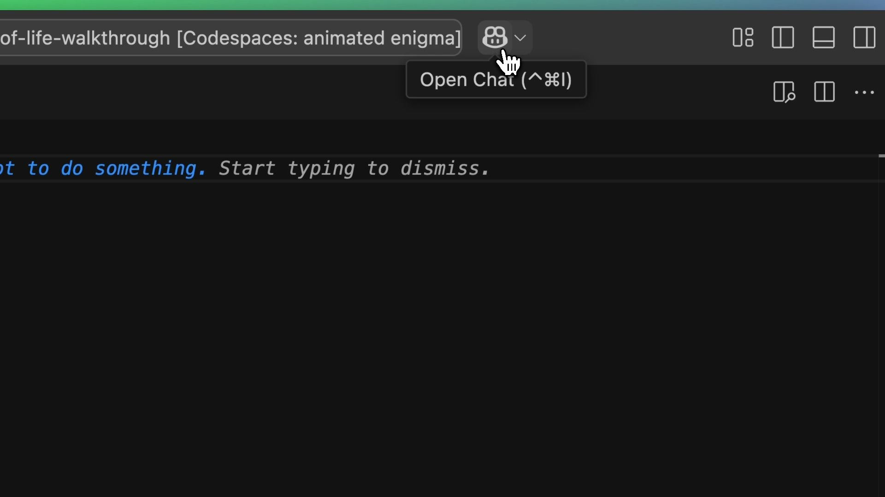
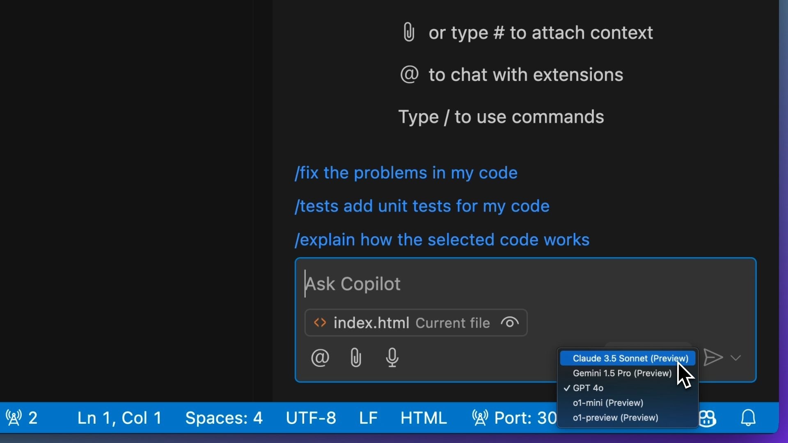
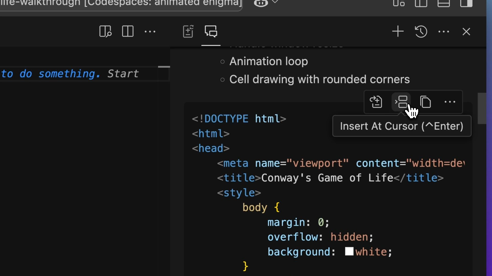
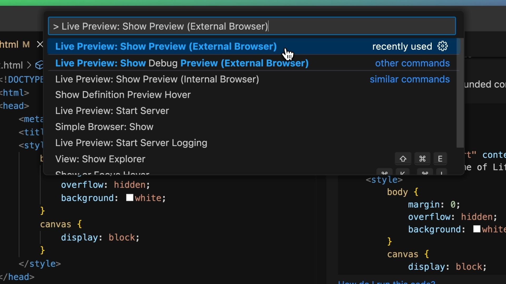
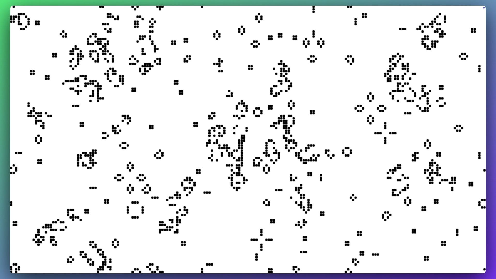
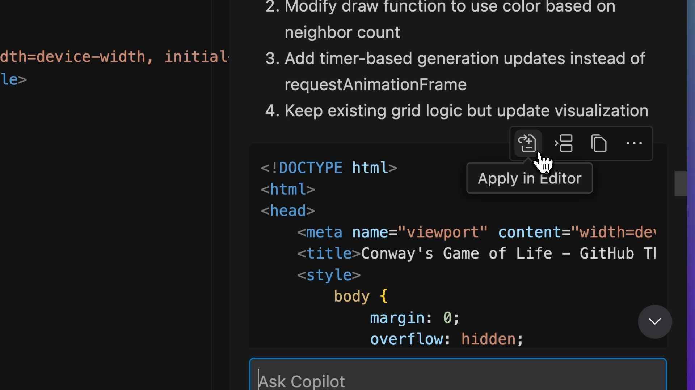
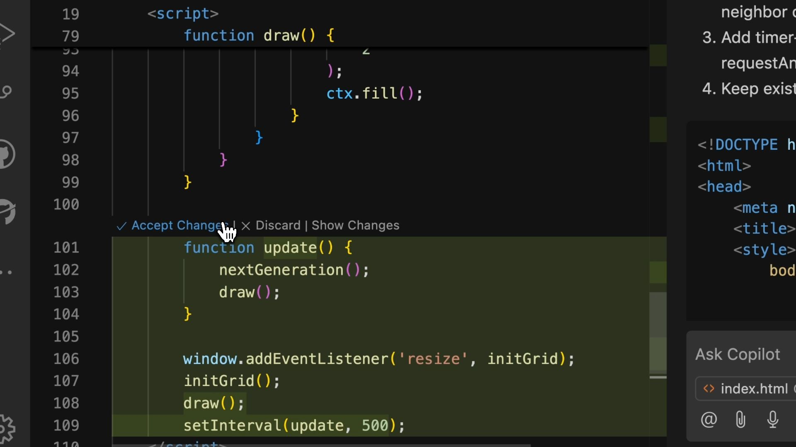
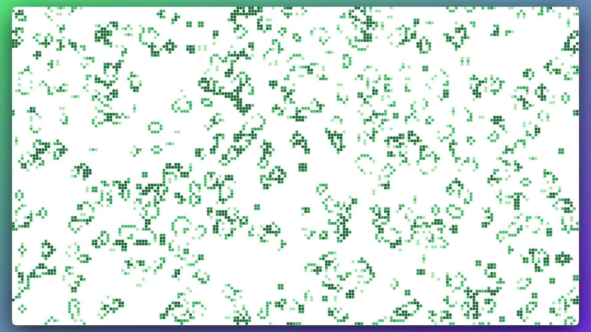

# Getting started with GitHub Copilot Chat

| [← Back to README][walkthrough-previous] | [Next: Copilot Edits →][walkthrough-next] |
|:-----------------------------------|------------------------------------------:|

## Opening Copilot Chat

The `index.html` file should already be open in your editor.
Open Copilot Chat by clicking the GitHub Copilot icon in the top right 
corner of Visual Studio Code.



### Selecting a Model

In the Copilot Chat pane, select the model picker in the chat box 
towards the bottom of the screen. 



> [!NOTE]
> You should see a list of models in the drop down menu. These will vary 
> based on your (or your organization's) Copilot settings.
>
> We have used the `Claude 3.5 Sonnet (Preview)` model for this walkthrough, 
> but you can choose your preferred model from the list.
>
> Remember, AI models are non-deterministic and may generate different
> results even if > you use the same model and the same prompt.
>
> So you may see different suggestions than what is shown throughout
> this walkthrough, > and may need to adapt the instructions accordingly.

## Creating the Game of Life

Copy the below instructions to GitHub Copilot:

```plaintext
Create a static website in a single file that shows Conway's game of life in a responsive web page the full height and width of the device. The individual cells should be 10px squares on a white background. Use a 2px radius for rounding on the cells.
```

Those instructions are often known as a prompt. The prompt is 
how we tell GitHub Copilot what we want.

> [!TIP]
> You might notice the prompt is pretty specific! We're specifying
> that we want a > single file, a responsive page and the size of the
> cells. Just like working with another developer, clear and specific
> instructions help Copilot understand your > needs better. For more 
> tips, visit [Copilot Prompt Tips][github-copilot-prompt-tips].
>
> Want to try out more prompts? Check out the 
> [Copilot Chat Cookbook][copilot-chat-cookbook].

### Implementing the Code

Now, let's take a look at the response. Scrolling through, we can 
see that GitHub Copilot has generated a full HTML document for us.
We can hover over the suggested code and use the `Insert At Cursor`
button to copy the code directly to our editor. 



> [!TIP]
> It's a good practice to review the code before integrating it into your own codebase.

## Running the Code

This code is a static HTML file with some JavaScript and CSS. We can 
run it in a web browser to see the game of life in action. To achieve 
this, we can spin up a local server using 
[Microsoft's Live Preview Visual Studio Code extension][visual-studio-code-live-preview].

> [!NOTE]
> This extension should already be installed as part of your GitHub 
> Codespace. If > you're using Visual Studio Code locally without 
> GitHub Codespaces, you may need to install the extension.

To start the server, open the command palette with the shortcut:

- macOS: <kbd>CMD</kbd> + <kbd>Shift</kbd> + <kbd>P</kbd>
- Windows / Linux: <kbd>CTRL</kbd> + <kbd>Shift</kbd> + <kbd>P</kbd>

In the command palette, type `> Live Preview: Show Preview (External Browser)`
 and select it. This will open the game of life in your default browser.

> [!TIP]
> Don't forget the `>` at the beginning of the command. The `>` prefix
> is used to filter the command palette to show only the commands that 
> match the text you have > entered (filtering out other items like 
> files or symbols).



Now, the moment of truth! Is it working? You should see 
the game of life running in your browser!



## Iterating on the Code

Now, we have a working game of life! But as developers, we don't
write perfect code first time. We know that we need to iterate 
on it, so let's do that with Copilot! 

Let's base the color scheme on the GitHub Contribution graph 
and slow down the new cell generation!

```plaintext
Let's make it GitHub Themed. Can we make the squares green, and then lighter or darker dependent on the number of squares around it?
Use these specific hex values 9be9a8, 40c463, 30a14e, 216e39. New generation should be every 0.5s
```

### Applying Changes

GitHub Copilot will likely respond with the requested changes 
in a code block. It might respond with a rewrite of the entire file, 
or it might respond with the changes that need to be made to the file. 
In either case, we want to go down the path of least resistance in 
bringing the changes into our existing code. Rather than copying 
and pasting the code block, we can use the `Apply in Editor` button. 



By clicking on the `Apply in Editor` button, Copilot will analyze 
the code using AI and speculative decoding to present the 
necessary changes as a diff for us to review and approve.



Now let's run the code again and review the changes. And, 
we have our GitHub-Themed game of life!



## Wrap-up

In this section, we've learned how to:

- Open and use Copilot Chat in Visual Studio Code
- Write clear, specific prompts for Copilot
- Implement code suggestions from Copilot
- Run a local development server using Live Preview
- Iterate on code with Copilot's help
- Review and apply code changes using the diff view

Now that we have our basic game working, let's explore how we 
can use Copilot to help us make more focused edits to our code.

## Useful Resources

- [Copilot Chat Cookbook][copilot-chat-cookbook]
- [GitHub Copilot Prompt Tips][github-copilot-prompt-tips]
- [Using Copilot Chat in Visual Studio Code][copilot-chat]

| [← Back to README][walkthrough-previous] | [Next: Copilot Edits →][walkthrough-next] |
|:-----------------------------------|------------------------------------------:|

[copilot-chat]: https://code.visualstudio.com/docs/copilot/copilot-chat
[copilot-chat-cookbook]: https://docs.github.com/en/copilot/example-prompts-for-github-copilot-chat
[github-copilot-prompt-tips]: https://gh.io/copilot/prompt-tips
[visual-studio-code-live-preview]: https://marketplace.visualstudio.com/items?itemName=ms-vscode.live-server
[walkthrough-previous]: ../README.md
[walkthrough-next]: 2-copilot-edits.md
