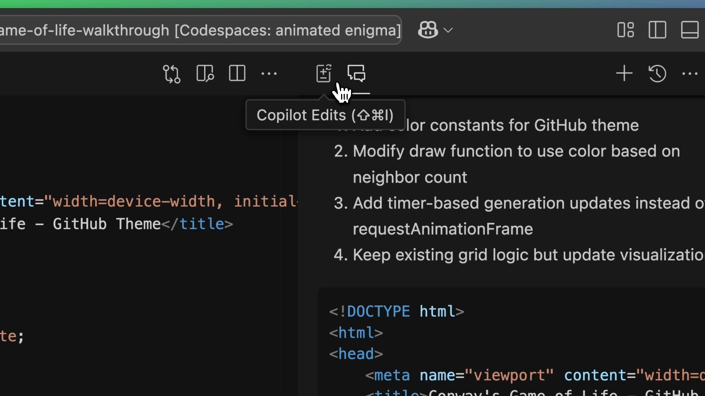
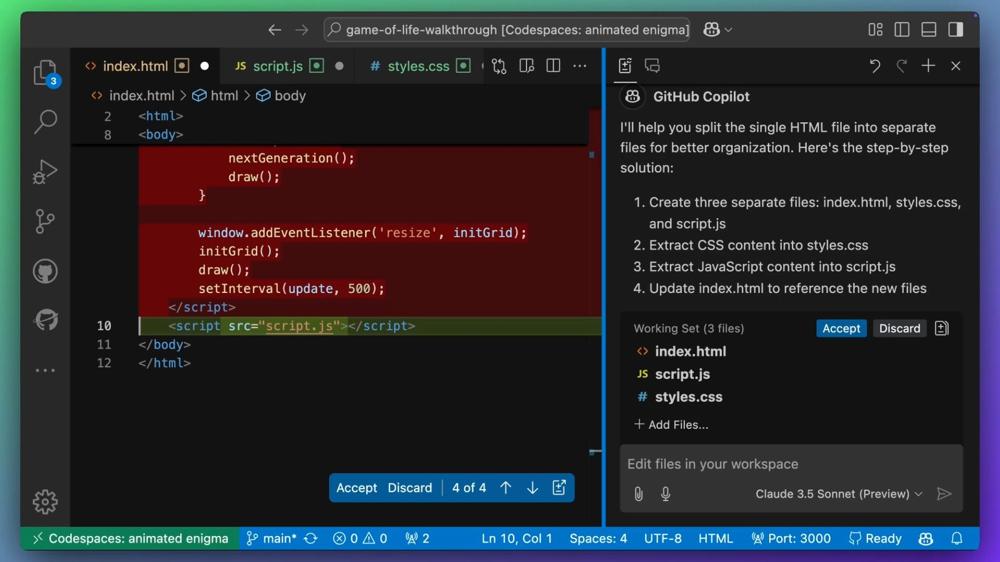
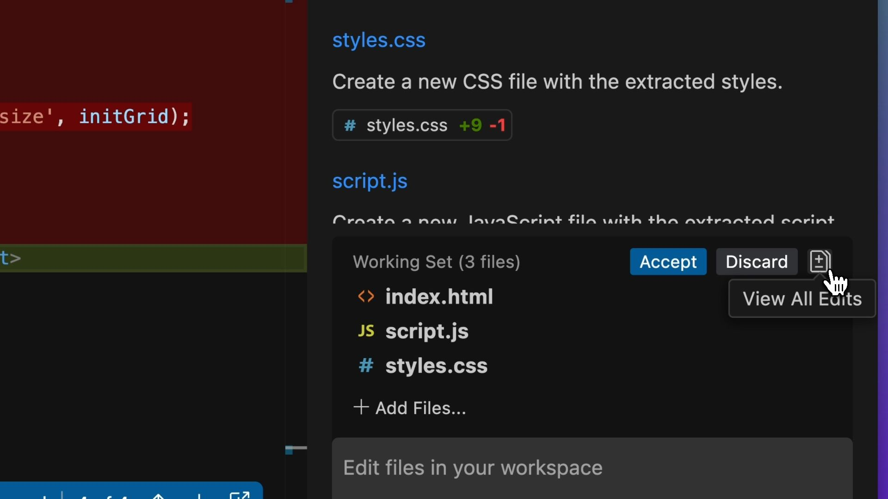
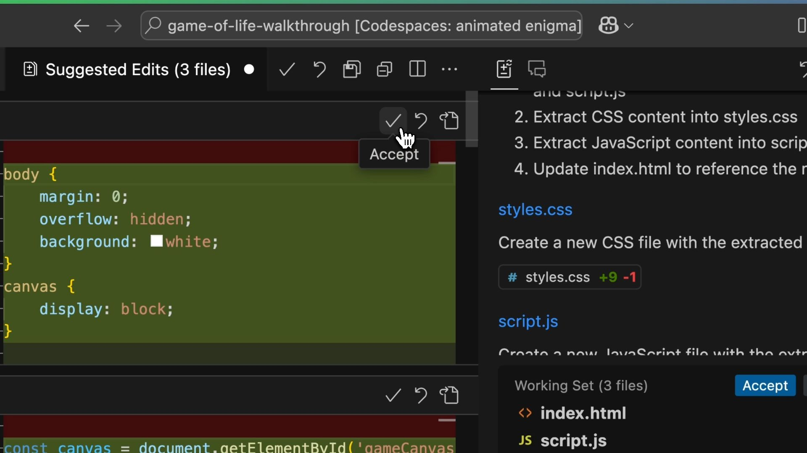
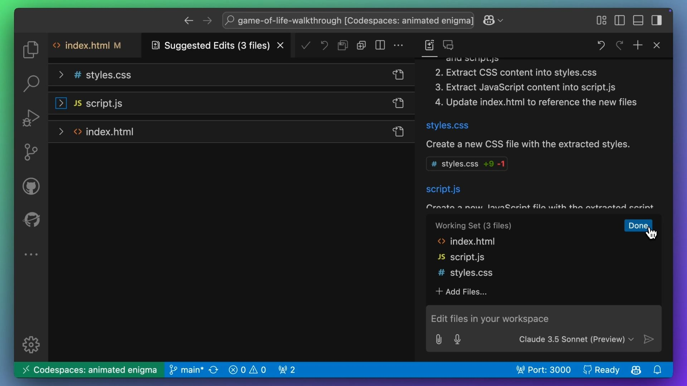

# Copilot Edits

| [← Copilot Chat][walkthrough-previous] | [Next: Copilot Instructions →][walkthrough-next] |
|:----------------------------------|----------------------------------------------------:|

Now you're probably thinking, "One single file for your HTML, JavaScript 
and CSS. Really?" We were iterating on a few ideas, but now it's time for 
us to break that single file into separate files for better decomposability.

But rather than manually creating the files and copying and pasting code 
between files, we can use [Copilot Edits][copilot-edits]! Navigate to 
Copilot Edits at the top of the Copilot pane, next to the chat icon.



Copilot Edits can make changes across multiple files, like creating files and making
changes to existing files. Just like in Copilot Chat, we use natural language 
convey our intent to GitHub Copilot.

In the chat box, enter the following prompt:

```plaintext
Split the file into separate HTML, JavaScript and CSS
```

Notice that Copilot Edits explains the plan before executing it, to make 
sure that we're confident that it's doing what we want. The output shows 
that it will update `index.html` and create `script.js` and `styles.css`. 
It also summarizes the diff (additions and deletions) per file.



Once Copilot has returned the suggested edits, we can click on the `View All Edits`
button to bring the files into a list view so they can be reviewed one by one.



We can scroll through each file, review the changes as a diff, and then 
accept the edit once we're happy. 



Then we can save the files, and mark the working set as done.



> [!TIP]
> You can drag and drop files from the Outline View or Breadcrumbs into 
> Copilot Edits or Copilot Chat. This is a great way to quickly bring 
> additional files into the working set, or as context for Copilot to 
> work with.

Great work! You've now used Copilot Edits to refactor your code across multiple files.
This is a powerful feature that can help you make sweeping changes across your codebase
with ease.

## Wrap-up

In the next section, we'll look at how to provide additional instructions to GitHub
Copilot to tailor the its responses.

## Useful Resources

- [Copilot Edits documentation][copilot-edits]

| [← Copilot Chat][walkthrough-previous] | [Next: Copilot Instructions →][walkthrough-next] |
|:----------------------------------|----------------------------------------------------:|

[copilot-edits]: https://code.visualstudio.com/docs/copilot/copilot-edits
[walkthrough-previous]: 1-copilot-chat.md
[walkthrough-next]: 3-copilot-instructions.md
