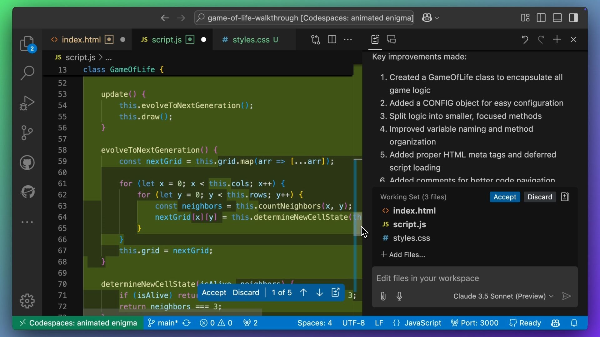
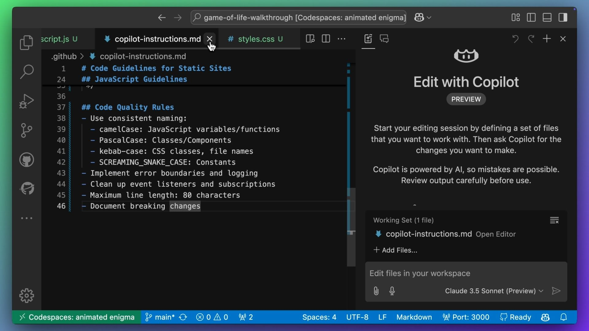
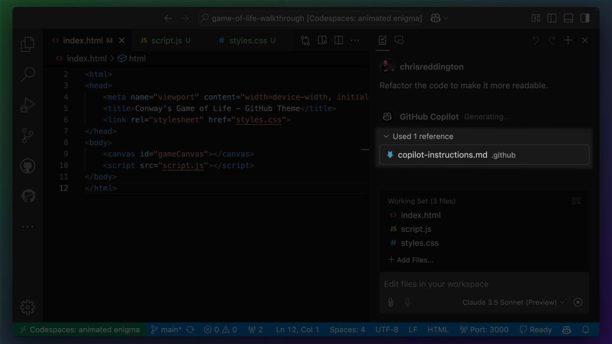
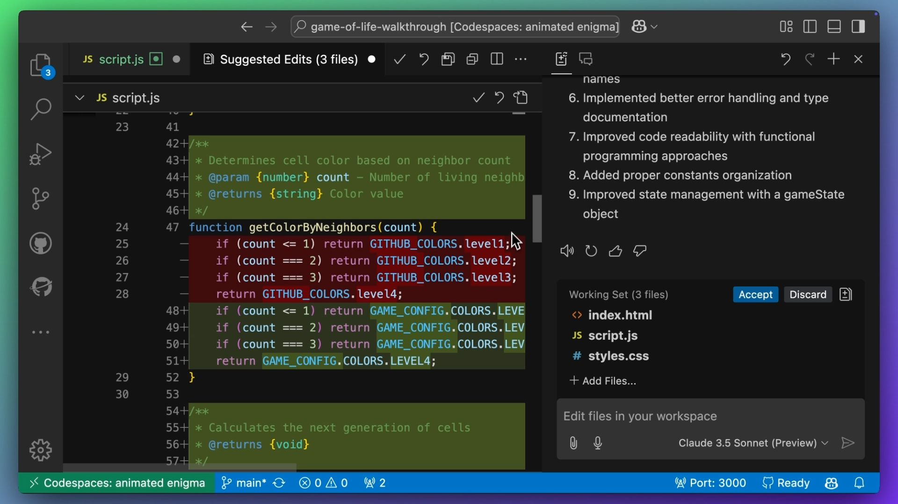
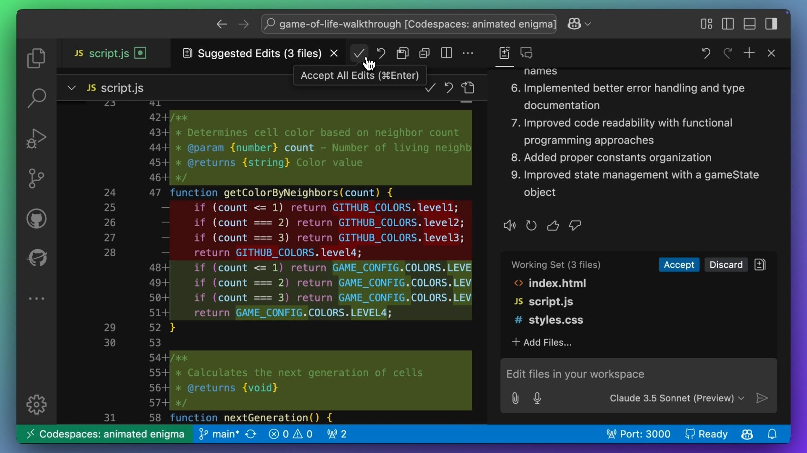

# Copilot Instructions

| [← Copilot Edits][walkthrough-previous] | [Next: Slash Commands →][walkthrough-next] |
|:----------------------------------------|------------------------------------------:|

## Improving Code Readability

Now let's complete another common development task, refactoring our code to 
improve readability! 

With the `index.html`, `script.js` and `styles.css` files in the working set, 
use Copilot Edits to improve the readability of the code by providing the 
following prompt:

```plaintext
Refactor the code to make it more readable.
```

### Reviewing Initial Changes

As you scroll through the suggestion, you may notice that Copilot has made 
several changes. That may include renaming variables, changing the order of 
methods, or even adding new classes.



## Using Copilot Instructions

But as the developer, we're in control. We didn't specify any specific 
standards or approaches to guide Copilot's response. So what if our 
team has a specific style guide or conventions? For example, we might 
want to use HTML5 meta tags, JSDoc documentation, or even a specific 
naming convention.

This is where [Copilot Instructions][copilot-instructions] come in. We 
can create a `.github/copilot-instructions.md` file, which Copilot will 
use as context for future requests.

> [!NOTE]
> The `.github` folder is a special folder stored in the root of your 
> repository. The `copilot-instructions.md` file is a markdown file that 
> contains the instructions for Copilot to follow and must be stored in 
> the `.github` folder.



### Example Instructions

Below is an example you can use. Feel free to tweak and experiment with these 
instructions to see how they change the suggested code.

```markdown
# Code Guidelines for Static Sites

## Required File Structure

## HTML Standards
- Use HTML5 doctype and specify language attribute
- Include charset (UTF-8) and responsive viewport meta tags
- Place scripts at bottom of body with appropriate defer/async attributes
- Use semantic elements with proper ARIA attributes where needed
- Ensure proper heading hierarchy (h1-h6)
- Include meta description for SEO

## CSS Organization
Group styles in this order:
1. Reset/Normalize
2. CSS Custom Properties (variables)
3. Base styles
4. Layout/Grid 
5. Components
6. Utilities
7. Media queries
8. Print styles

## JavaScript Guidelines

- Adhere to JSDoc standards, similar to the below example
/**
 * @description Clear description of purpose and behavior
 * @param {type} name - Description with valid/invalid values
 * @returns {type} Description of return value/state
 * @throws {ErrorType} Description of error conditions
 * @example
 * // Include multiple examples showing edge cases
 * functionName(validInput);
 */

## Code Quality Rules
- Use consistent naming:
  - camelCase: JavaScript variables/functions
  - PascalCase: Classes/Components
  - kebab-case: CSS classes, file names
  - SCREAMING_SNAKE_CASE: Constants
- Implement error boundaries and logging
- Clean up event listeners and subscriptions
- Maximum line length: 80 characters
- Document breaking changes
```

## Implementing with Instructions

Let's ask to improve the readability of the code again. Make sure to include 
`index.html`, `script.js` and `styles.css` in the working set, Let's use the 
exact prompt as earlier for comparison:

```plaintext
Refactor the code to make it more readable.
```

### Reviewing Results

However, this time, notice that the `copilot-instructions.md` file is
being used as a reference? This shows that GitHub Copilot is using the 
instructions in that file to guide its suggestions.



In the response, we can see that Copilot has suggested a number of changes, 
including edits with HTML5 meta tags, JSDoc documentation and incorporated the 
instructions.



### Applying Changes

As we did in the earlier Copilot Edits step, we can review the changes per file 
and accept the edit. Alternatively, we can accept the edit for all files at once.



Before we move on to the next section, let's switch across to the browser and 
check that our game of life is still working as expected.


## Summary

Excellent! The refactoring was successful, our code is more readable and more 
closely follows our standards. We can see how 
[Copilot Instructions][copilot-instructions] help maintain code quality and 
consistency across a project.

Ready to explore more? Let's look at how 
[Copilot's slash commands][walkthrough-next] can enhance our productivity 
even further.

## Useful Resources

- [GitHub Copilot Instructions Documentation][copilot-instructions]

| [← Copilot Edits][walkthrough-previous] | [Next: Slash Commands →][walkthrough-next] |
|:----------------------------------------|------------------------------------------:|

[copilot-instructions]: https://docs.github.com/en/copilot/customizing-copilot/adding-custom-instructions-for-github-copilot
[walkthrough-previous]: 2-copilot-edits.md
[walkthrough-next]: 4-slash-commands.md
