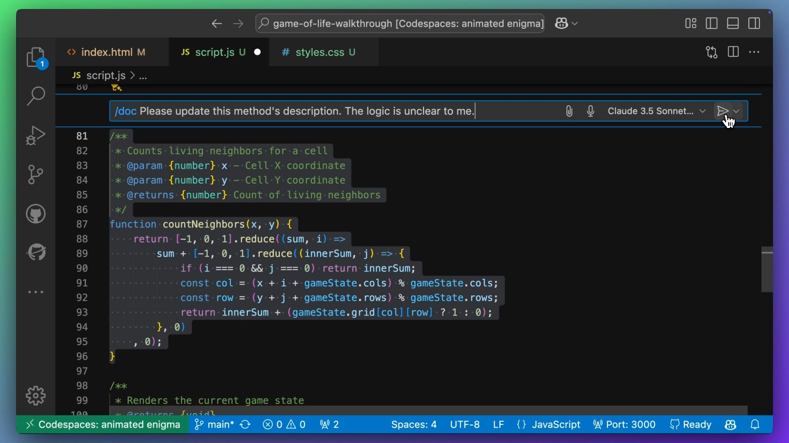
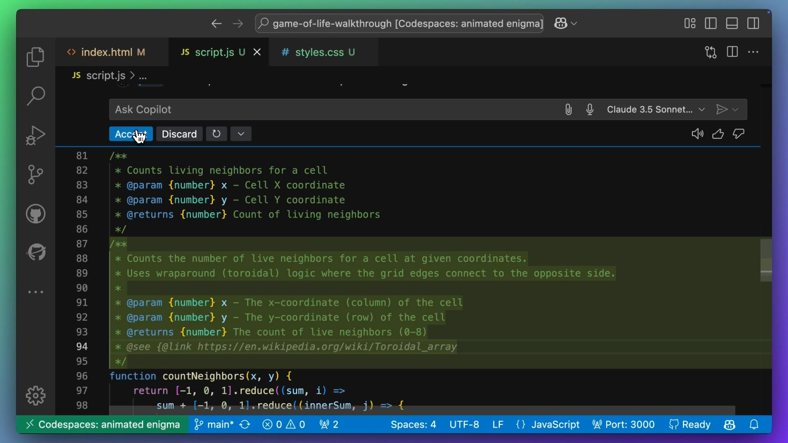
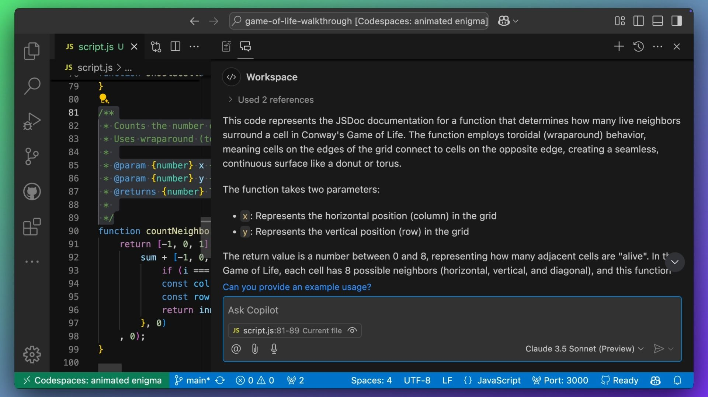

# Using Inline Chat

| [← Copilot Instructions][walkthrough-previous] | [Next: README and Extensions →][walkthrough-next] |
|:------------------------------------------------|----------------------------------------------------:|

So far, we've been using Copilot Chat in the chat pane. But you can also use
[inline chat][visual-studio-code-inline-chat] to stay in the flow by having
access to chat directly in the editor.

> [!NOTE]
> When you're in the editor pane, you can use the shortcut:
>
> - macOS: <kbd>CMD</kbd> + <kbd>I</kbd>
> - Windows / Linux: <kbd>CTRL</kbd> + <kbd>I</kbd>

## Using Slash Commands

You can even perform common tasks using [slash commands][visual-studio-code-slash-commands].
Think of slash commands as convenient shortcuts for tasks that developers 
frequently complete.

> [!TIP]
> You can use slash commands in the Copilot Chat pane too! We'll see that in a moment.
> Be aware that the available slash commands differ between the inline chat 
> and the chat pane.

### Example: Documenting Code

Scroll to the `countNeighbors` method (or any method which is a little hard to 
understand). In our `countNeighbors` example, the code isn't immediately 
clear as there are several single letter variables and a few nested loops. 
Use the shortcut to open inline chat.



Enter the following prompt:

```plaintext
/doc Please update this method's description. The logic is unclear to me.
```

Copilot should suggest an updated JSDoc comment for the method, with a more 
detailed description of the logic. It might include some new terms, such as 
a Torus or a Toroidal Array/Grid. Review the suggested JSDoc comment and 
accept it if it makes sense.



Select the entire method, including the new JSDoc comment that you just 
accepted. Navigate to the chat pane (you may need to switch from Copilot 
Edits) and use `/explain` to get a detailed explanation of the code in 
plain English.

> [!TIP]
> You can run the `/explain` slash command in the inline chat or in the 
> Copilot Chat pane, so we'll leave this as an exercise for you to try!



## Wrap-up

In this section we learned about inline chat and slash commands. Take 
some time to explore these commands and see how they can help improve 
your development workflow.

Next, we'll [create a README and explore Copilot Extensions][walkthrough-next].

## Useful Resources

- [Inline Chat in Visual Studio Code][visual-studio-code-inline-chat]
- [Slash Commands in Visual Studio Code][visual-studio-code-slash-commands]

| [← Copilot Instructions][walkthrough-previous] | [Next: README and Extensions →][walkthrough-next] |
|:------------------------------------------------|----------------------------------------------------:|

[visual-studio-code-inline-chat]: https://code.visualstudio.com/docs/copilot/getting-started-chat#_stay-in-the-flow-with-inline-chat
[visual-studio-code-slash-commands]: https://code.visualstudio.com/docs/copilot/copilot-chat#_slash-commands
[walkthrough-previous]: 3-copilot-instructions.md
[walkthrough-next]: 5-readme-and-extensions.md
