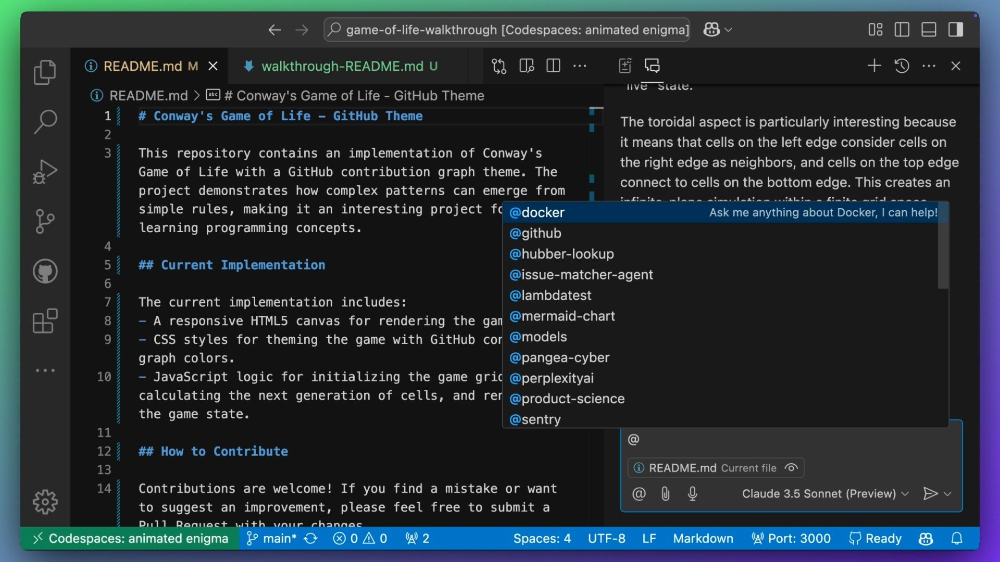
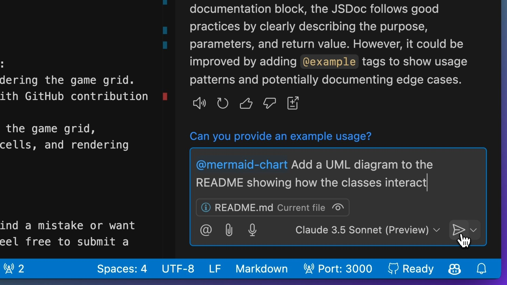

# Using Copilot Edits to create a README

| [← Slash Commands][walkthrough-previous] | [Next: Actions and Pages →][walkthrough-next] |
|:--------------------------------------|------------------------------------------------:|

Now that we have our code, we need to add documentation!

[READMEs][github-readme] are incredibly helpful when we're trying to learn 
about a new repository. Let's use [Copilot Edits][copilot-edits] to create 
one for us, summarizing the app, how it's implemented, and most importantly, 
how the community can contribute! We were last in the chat view. To switch to 
Copilot Edits, click on the `Copilot Edits` tab at the top of the Copilot pane.

Add the `index.html`, `script.js`, and `styles.css` files to the working set.

> [!TIP]
> You can drag and drop the files as we introduced earlier. Alternatively, you 
> can use the paperclip icon or the `Add files` button in the Copilot Edits 
> pane to reveal a dropdown of recently opened files.
>
> When you have a file selected, you can quickly add them to the working set 
> by using the following keyboard shortcuts:
> 
> - macOS: <kbd>Cmd</kbd> + <kbd>→</kbd>
> - Windows / Linux: <kbd>Ctrl</kbd> + <kbd>→</kbd>

Once you have the files added to the working set, provide a prompt to Copilot 
Edits to generate a README file.

```plaintext
Please take two steps in order:

1. Create walkthrough-README.md which contains the current contents of README.md.
2. Replace README.md and summarize the purpose of the repository, the current implementation and how users can contribute to it.
```

Copilot will create a new `README.md` file for us. We can review the changes, 
and accept the edit.


If you're happy with the changes, accept the edit and save the files. You can 
also mark the working set as done.

## Using Copilot Extensions

We've been using [Copilot Chat][copilot-chat] and 
[Copilot Edits][copilot-edits] to help us with our code. But what if we want 
to use Copilot with our preferred tools and services?

For example, I'm much more of a visual learner. And I'd love to see some class 
diagrams to understand how the classes relate, and what methods are available. 
[Copilot Extensions][copilot-extensions] can help us with that. 
The [Mermaid Chart extension for GitHub Copilot][mermaid-chart-extension] can 
help us write mermaid diagrams.

> [!NOTE]
> This step is entirely optional. If you're not interested in creating UML 
> diagrams, feel free to skip this section. You can still follow along to see 
> how Copilot Extensions work!
>
> You will need to install the 
> [Mermaid Chart extension for GitHub Copilot][mermaid-chart-extension] 
> from the GitHub Marketplace to use this feature.
>
> Once you have the extension installed, refresh your Visual Studio Code window 
> to enable the extension. You can do this by opening the command palette and 
> running the reload window command:
>
> - macOS: <kbd>Cmd</kbd> + <kbd>Shift</kbd> + <kbd>P</kbd>
> - Windows / Linux: <kbd>Ctrl</kbd> + <kbd>Shift</kbd> + <kbd>P</kbd>
> 
> In the command palette, type `> Developer: Reload Window` and select it.

We were last in Copilot Edits, so let's switch back to Copilot Chat. You can 
invoke extensions by typing the `@` symbol into the chat pane. You should see 
a list of installed extensions, including the Mermaid Chart extension that you 
just setup.



## Creating UML Diagrams

Let's ask Copilot to help us write a UML diagram for our classes. Before you 
do that, make sure you've added the relevant files as context for Copilot (such 
as the `script.js` file). 

> [!TIP]
> You can do this by dragging and dropping into the chat pane, or by using the 
> paperclip icon in the chat pane.

Add the following prompt to the chat pane:

```plaintext
@mermaid-chart Add a UML diagram to the README showing how the classes interact
```



Just like the earlier responses from Copilot, you can review the suggested 
codeblocks and incorporate them into your README file (either by copying the 
code, inserting at the cursor or using `Apply in Editor`.). We'll leave this 
as an exercise for you to complete.

## Wrap-up

In this section, we've explored how GitHub Copilot can assist with 
documentation tasks:

- Using Copilot Edits to generate a comprehensive README.md file
- Leveraging Copilot Extensions, specifically the mermaid extension
- Creating UML diagrams to visualize class relationships

Next up, we'll see how Copilot can help 
us [create a GitHub Actions workflow to deploy to GitHub Pages][walkthrough-next].

## Useful Resources

- [About READMEs][github-readme]
- [GitHub Copilot Chat documentation][copilot-chat]
- [GitHub Copilot Edits documentation][copilot-edits]
- [GitHub Copilot Extensions documentation][copilot-extensions]
- [Mermaid Chart extension for GitHub Copilot][mermaid-chart-extension]

| [← Slash Commands][walkthrough-previous] | [Next: Actions and Pages →][walkthrough-next] |
|:--------------------------------------|------------------------------------------------:|

[copilot-chat]: https://code.visualstudio.com/docs/copilot/copilot-chat
[copilot-edits]: https://code.visualstudio.com/docs/copilot/copilot-edits
[copilot-extensions]: https://docs.github.com/en/copilot/using-github-copilot/using-extensions-to-integrate-external-tools-with-copilot-chat
[github-readme]: https://docs.github.com/en/repositories/managing-your-repositorys-settings-and-features/customizing-your-repository/about-readmes
[mermaid-chart-extension]: https://github.com/marketplace/mermaid-chart
[walkthrough-previous]: 4-slash-commands.md
[walkthrough-next]: 6-actions-and-pages.md
