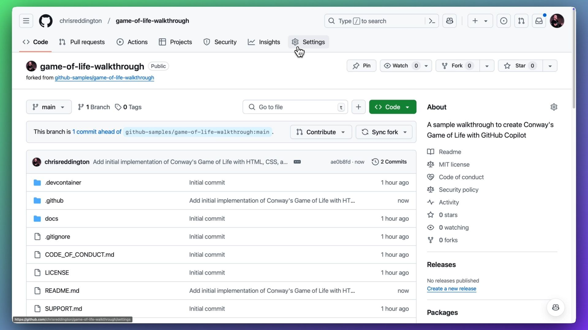
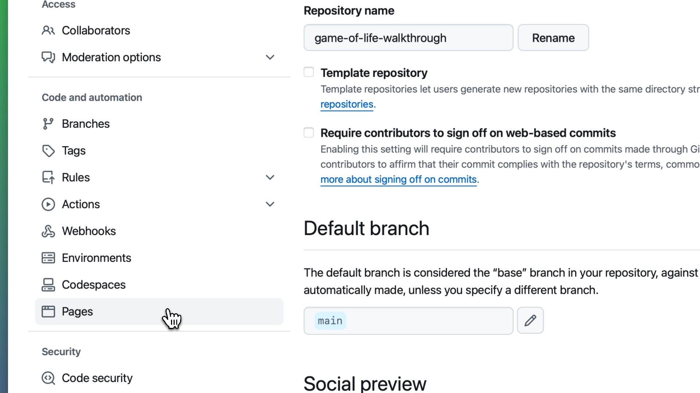
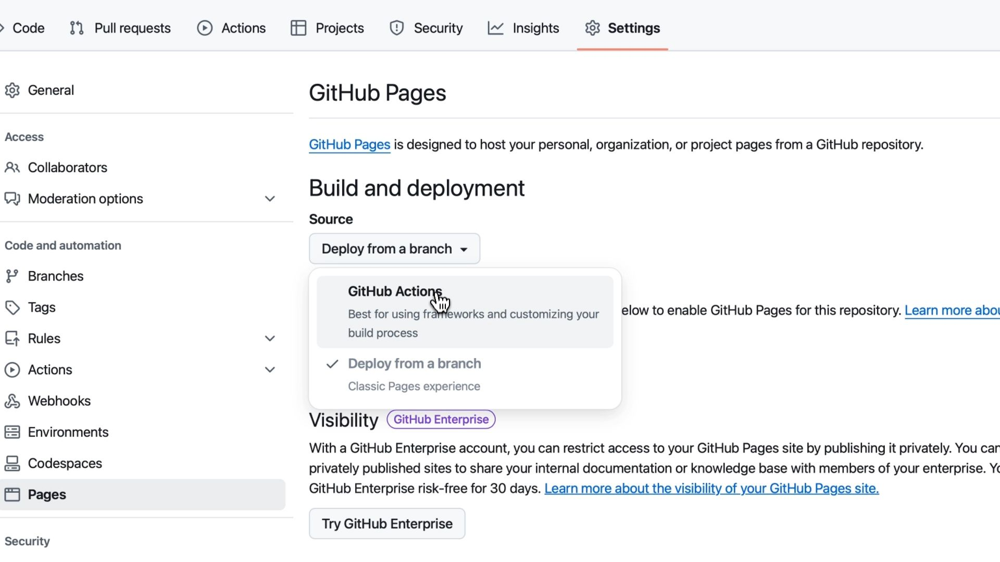
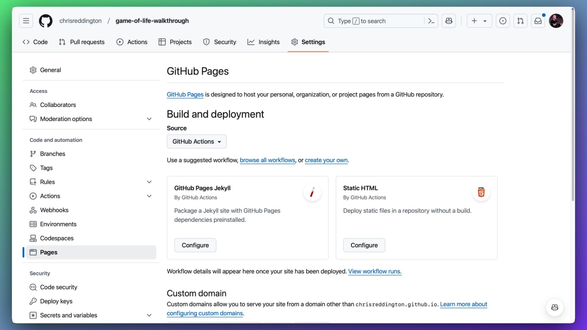
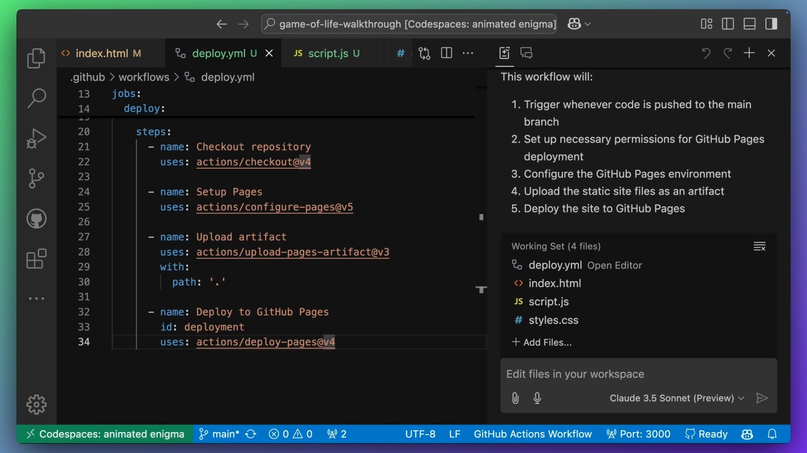
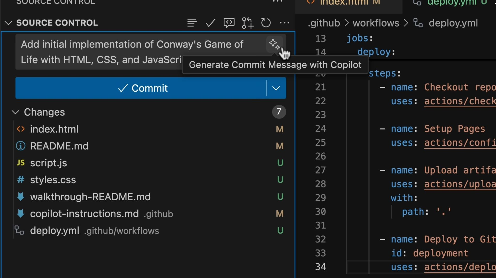
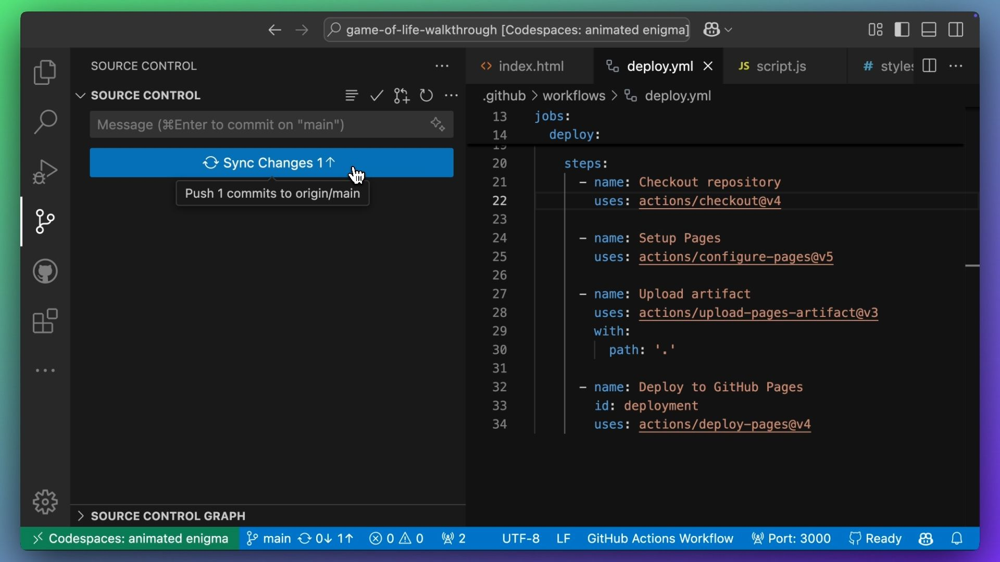
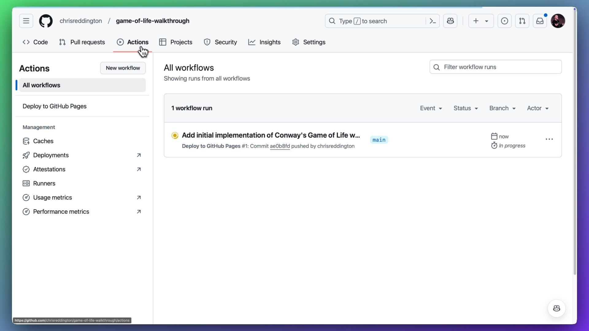
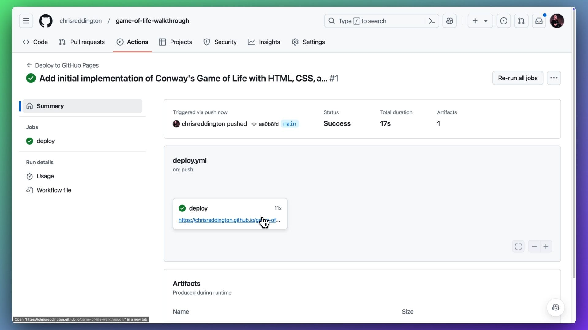

# Deploying to GitHub Pages (Optional)

| [← README and Extensions][walkthrough-previous] | [Back to README →][walkthrough-next] |
|:--------------------------------------------------|--------------------------------:|

**This section is optional.** We will deploy our site to 
[GitHub Pages][github-pages] and use Copilot to help us 
create a [GitHub Actions workflow file][github-actions]. 
If you want to skip this section, feel free to do so!

> [!NOTE]
> You can setup GitHub pages on a public repository for free. If you created 
your fork as a public repository, then you should be able to progress with the 
setup steps. However, for private repositories, please check the 
[documentation][github-pages] to determine if you are using a plan that 
supports GitHub Pages.
>
> If you do not have access to GitHub Pages, you can still follow along with 
> the rest of the tutorial.
>
> Before we create the GitHub Actions workflow, we need to make sure that 
> GitHub Pages is enabled for our repository. If you have not already done so, 
> please follow the steps below to enable GitHub Pages in the repository.

## Pre-requisites: Setup GitHub Pages

Open your GitHub repository in your web browser. Navigate to the settings tab.



Scroll down to the GitHub Pages section.



On the GitHub Pages settings page, select the dropdown under "Source" and 
select "GitHub Actions". 



This will allow us to deploy our site to GitHub Pages using GitHub Action Workflows.



## Create a GitHub Actions Workflow

We have our code and our README. So now, let's deploy the site! We'll use 
[GitHub Actions][github-actions] to deploy our static website to 
[GitHub Pages][github-pages].

By now you've probably guessed, we will use GitHub Copilot to help us out. 
Specifically, we'll use [Copilot Edits][copilot-edits] to create a GitHub 
Actions workflow file.

Navigate back to Copilot Edits by clicking the Copilot Edits icon at the top 
of the chat pane. In the chat box, enter the following prompt:

```plaintext
Write a GitHub Actions Workflow file to deploy this site to GitHub Pages on a push to main.
```



Copilot should generate a GitHub Actions workflow file for you. Review the 
changes, and if you are happy, accept the edits, save the file and mark the 
working set as done.

## Commit and Push

Now that we have our code, README and GitHub Actions workflow, let’s commit 
the changes to our Git repository. We can even use GitHub Copilot to help write 
the commit message by clicking the sparkle icon next to the commit message box.



Now let's push the code from our local Git repository to our GitHub repository. 
As we committed our code to the `main` branch, the GitHub Actions workflow 
should trigger and deploy our site to GitHub Pages.



## Check the Deployment

Open your repository in a web browser and navigate to the Actions tab. You 
should see that the push to the main branch triggered a GitHub Actions workflow run.



After a few moments, the workflow should complete and hopefully result in a 
successful deployment to your GitHub Pages site!



Congratulations, you now have a GitHub-themed game of life running on GitHub Pages!


## Tutorial Summary

Throughout this tutorial, we've explored several key aspects of GitHub Copilot:

1. [**Copilot Chat**][copilot-chat] - Learned how to write effective prompts 
and implement code suggestions using different models.

2. [**Copilot Edits**][copilot-edits] - Discovered how to make bulk changes 
and organize code across multiple files.

3. [**Copilot Instructions**][copilot-instructions] - Created custom 
instructions to maintain consistent coding standards.

4. [**Slash Commands**][visual-studio-code-slash-commands] - Used inline chat 
features for code documentation and explanation.

5. [**Copilot Extensions**][copilot-extensions] - Generated comprehensive 
documentation including READMEs and UML diagrams.

6. **Deployment** - Set up GitHub Pages and created a GitHub Actions 
workflows for automated deployment.

You now have a solid foundation in using GitHub Copilot as an AI pair 
programmer. We can't wait to see what you build next!

| [← README and Extensions][walkthrough-previous] | [Back to README →][walkthrough-next] |
|:--------------------------------------------------|--------------------------------:|

[copilot-chat]: https://code.visualstudio.com/docs/copilot/copilot-chat
[copilot-edits]: https://code.visualstudio.com/docs/copilot/copilot-edits
[copilot-extensions]: https://docs.github.com/en/copilot/using-github-copilot/
[copilot-instructions]: https://docs.github.com/en/copilot/customizing-copilot/adding-custom-instructions-for-github-copilot
[github-actions]: https://docs.github.com/en/actions/writing-workflows/quickstart
[github-pages]: https://docs.github.com/en/pages/getting-started-with-github-pages/about-github-pages
[visual-studio-code-slash-commands]: https://code.visualstudio.com/docs/copilot/copilot-chat#_slash-commands
[walkthrough-previous]: 5-readme-and-extensions.md
[walkthrough-next]: ../README.md
